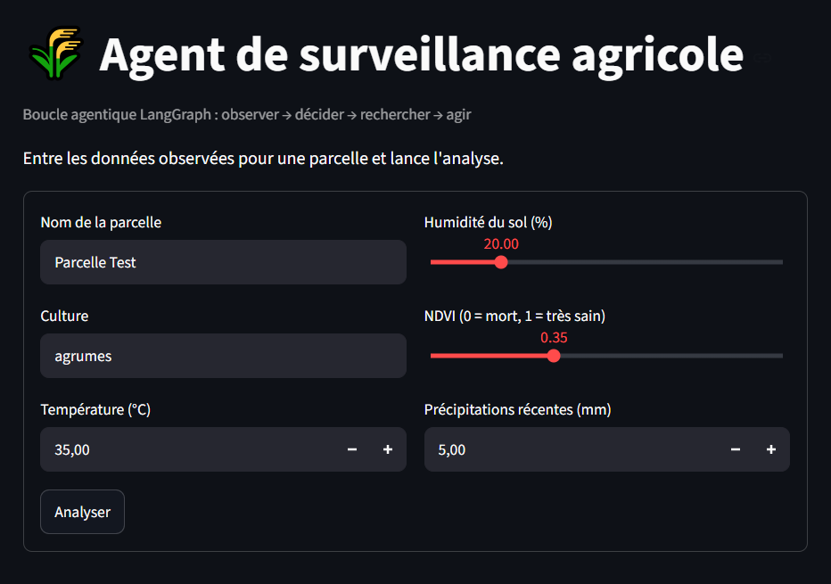
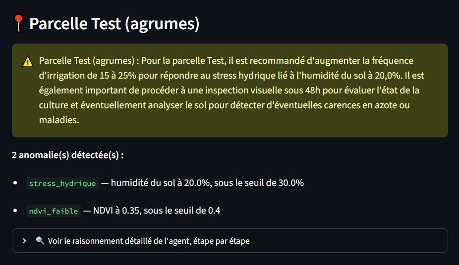
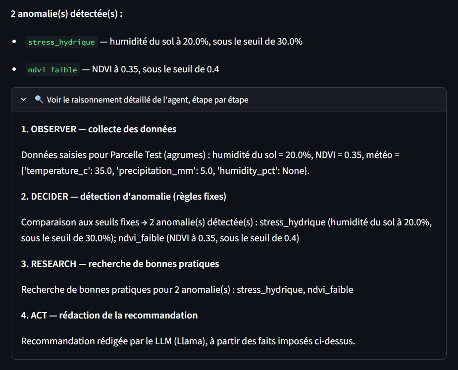

# Agricultural Agent (LangGraph)

Agentic monitoring system for farm plots: observes soil moisture, NDVI, and
weather data, detects anomalies and generates tailored recommendations.

## Installation

```bash
pip install -r requirements.txt
```

## Run the dashboard (manual input)

```bash
streamlit run dashboard/app.py
```

This is the main entry point: you manually enter the observed data (soil
moisture, NDVI, weather) for a plot, and the agent analyzes it. This lets
you test precise scenarios (water stress alone, low NDVI alone, both at
once, or a normal situation) instead of relying on random data.

**Explainability:** for each analysis, the dashboard shows the detailed
reasoning of every step (`OBSERVER`, `DECIDER`, `RESEARCH`, `ACT`), not just
the final result.

## Run via CLI (optional)

```bash
python main.py
```

Simulates data for the plots listed in `data/parcelles.csv` and runs the
agent on them (less convenient for testing a specific case than the
dashboard).

## Pipeline architecture

- **`observer_node`**: logs the data received for the plot (manually entered), no decision made here, just recording what was observed.
- **`decider_node`**: detection using FIXED RULES only (thresholds on soil moisture and NDVI). Soil and NDVI are checked independently, so a plot can accumulate several anomalies in `state["anomalies"]`.
- **`research_node`**: looks up a best practice for each detected anomaly in a fixed local knowledge base, no decision, just a lookup, skipped entirely if no anomaly was found.
- **`act_node`**: writing is delegated to the LLM (Llama 3 via Ollama), which receives the diagnosis already established by the rules and ONLY phrases it in natural language, numeric decisions are never delegated to the LLM.

Only two nodes actually decide something: `decider_node` (whether there's an anomaly) and `act_node` (how to phrase the result). `observer_node` and `research_node` just record and look up data.

## Using a real LLM (Ollama, free)

1. Install [Ollama](https://ollama.com)
2. `ollama pull llama3:8b` (~4.7 GB, a smaller model like `llama3.2:3b`
   also works but reasons less well for the writing step)
3. Start Ollama (usually automatic after install, otherwise `ollama serve`)
4. Restart the dashboard or `python main.py`, the logs will show
   `[ACT-LLM]` instead of `[ACT-RULES]`

**Robustness:** if Ollama isn't installed/running, the agent automatically
falls back to a fixed text generated via f-string, and never crashes.

To fully disable the LLM, set `USE_LLM_FOR_WRITING = False` in `config.py`.

## Tests

```bash
pytest tests/ -v
```

20 tests cover the most critical logic in the project: anomaly detection
(`decider_node`), the graph's conditional routing, full end-to-end execution
(normal case, single anomaly, double anomaly), and the LLM integration
itself, using a mocked LLM so the tests stay fast and don't depend on
Ollama being installed.

**CI:** tests run automatically on every push/pull request to `main` via
GitHub Actions (`.github/workflows/tests.yml`), on Python 3.11 and 3.12.

## Project structure

```
agri-agent/
├── .github/workflows/    # CI: runs pytest automatically
├── main.py               # CLI (simulated data from parcelles.csv)
├── config.py
├── agent/
│   ├── state.py           # Typed State, with "anomalies" (list) and "trace" (explainability)
│   ├── nodes.py            # observer / decider / research / act
│   ├── graph.py             # LangGraph wiring
│   └── llm.py                # writing via Ollama (never decides)
├── tools/                  # weather, soil, ndvi (simulated), search (knowledge base)
├── tests/                   # pytest: anomaly detection, routing, full graph, mocked LLM
├── data/                    # parcelles.csv (used only by main.py)
└── dashboard/
    └── app.py               # Streamlit : manual input + explainability
```
### Screenshots

<p align="center">
  
  
  
</p>

### Stack

`Python` · `LangGraph` · `Ollama (Llama 3:8b)` · `Streamlit` · `pytest` · `GitHub Actions`

---

# Agent Agricole (LangGraph)

Agent agentique de surveillance de parcelles : observe humidité du sol,
NDVI et météo, détecte les anomalies et génère des recommandations adaptées.

## Installation

```bash
pip install -r requirements.txt
```

## Lancer le dashboard (saisie manuelle)

```bash
streamlit run dashboard/app.py
```

C'est le point d'entrée principal : tu saisis toi-même les données observées
(humidité du sol, NDVI, météo) pour une parcelle, et l'agent les analyse.
Ça permet de tester des scénarios précis (stress hydrique seul, NDVI faible
seul, les deux en même temps, ou situation normale) plutôt que de dépendre
de données aléatoires.

**Explicabilité :** le dashboard affiche, pour chaque analyse, le
raisonnement détaillé de chaque étape (`OBSERVER`, `DECIDER`, `RESEARCH`,
`ACT`), pas seulement le résultat final.

## Lancer en CLI (optionnel)

```bash
python main.py
```

Simule des données pour les parcelles de `data/parcelles.csv` et lance
l'agent dessus (moins pratique pour tester un cas précis que le dashboard).

## Architecture du pipeline

- **`observer_node`** : journalise les données reçues pour la parcelle (saisies manuellement), aucune décision ici, juste l'enregistrement de ce qui a été observé.
- **`decider_node`** : détection par RÈGLES FIXES uniquement (seuils sur le sol et le NDVI). Le sol et le NDVI sont vérifiés indépendamment, donc une parcelle peut cumuler plusieurs anomalies dans `state["anomalies"]`.
- **`research_node`** : cherche une bonne pratique pour chaque anomalie détectée dans une base de connaissances locale fixe, aucune décision, juste une recherche, entièrement sautée si aucune anomalie n'est trouvée.
- **`act_node`** : rédaction déléguée au LLM (Llama 3 via Ollama), qui reçoit le diagnostic déjà établi par les règles et ne fait QUE le formuler en langage naturel, jamais de décision numérique déléguée au LLM.

Seuls deux nœuds décident réellement quelque chose : `decider_node` (s'il y a une anomalie) et `act_node` (comment formuler le résultat). `observer_node` et `research_node` ne font qu'enregistrer et chercher des données.

## Utiliser un vrai LLM (Ollama, gratuit)

1. Installer [Ollama](https://ollama.com)
2. `ollama pull llama3:8b` (~4,7 Go, un modèle plus petit comme
   `llama3.2:3b` fonctionne aussi mais raisonne moins bien pour la rédaction)
3. Lancer Ollama (généralement automatique après installation, sinon
   `ollama serve`)
4. Relancer le dashboard ou `python main.py`, les logs afficheront
   `[ACT-LLM]` au lieu de `[ACT-RULES]`

**Robustesse :** si Ollama n'est pas installé/lancé, l'agent bascule
automatiquement sur un texte de secours généré par f-string, sans jamais
planter.

Pour désactiver complètement le LLM, mettre `USE_LLM_FOR_WRITING = False`
dans `config.py`.

## Tests

```bash
pytest tests/ -v
```

20 tests couvrent la logique la plus critique du projet : la détection
d'anomalies (`decider_node`), le routage conditionnel du graphe, l'exécution
complète de bout en bout (cas normal, anomalie simple, double anomalie), et
l'intégration du LLM lui-même, via un LLM simulé (mock) pour que les tests
restent rapides et ne dépendent pas d'Ollama.

**CI :** les tests sont lancés automatiquement à chaque push/pull request
sur `main` via GitHub Actions (`.github/workflows/tests.yml`), sur
Python 3.11 et 3.12.

## Arborescence

```
agri-agent/
├── .github/workflows/    # CI : lance pytest automatiquement
├── main.py               # CLI (données simulées depuis parcelles.csv)
├── config.py
├── agent/
│   ├── state.py           # State typé, avec "anomalies" (liste) et "trace" (explicabilité)
│   ├── nodes.py            # observer / decider / research / act
│   ├── graph.py             # assemblage LangGraph
│   └── llm.py                # rédaction via Ollama (jamais de décision)
├── tools/                  # weather, soil, ndvi (simulés), search (base de connaissances)
├── tests/                   # pytest : détection d'anomalies, routage, graphe complet, LLM simulé
├── data/                    # parcelles.csv (utilisé par main.py uniquement)
└── dashboard/
    └── app.py               # interface Streamlit : saisie manuelle + explicabilité
```
### Captures d'écran

<p align="center">
  
  
  
</p>

### Stack

`Python` · `LangGraph` · `Ollama (Llama 3:8b)` · `Streamlit` · `pytest` · `GitHub Actions`